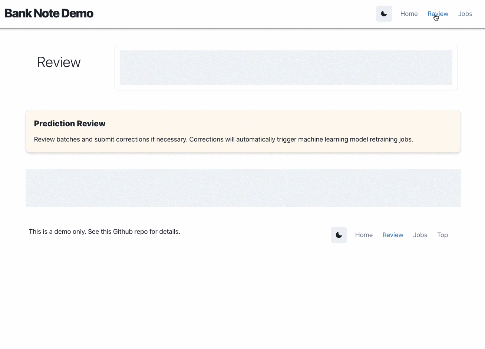
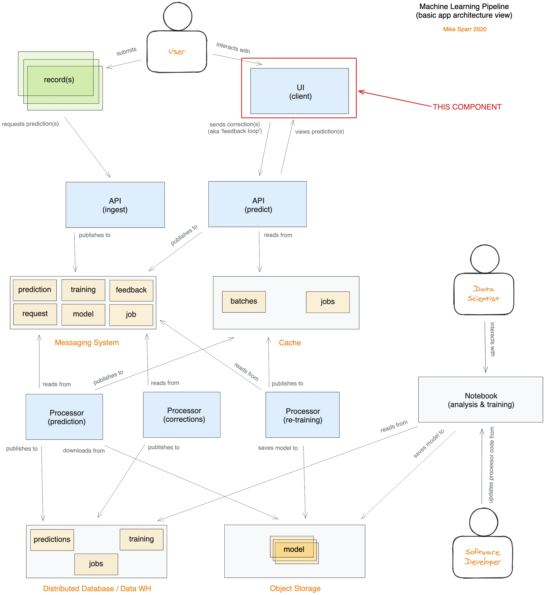

# AI Demo (Web Interface)
This is a demo app illustrating how to build a custom machine learning pipeline. It consists of 
this web interface built using NextJS/React and ChartsJS, plus two APIs using Golang and Cloud Run, 
and backend processors using Python and Cloud Functions.

# Demo (submit, review, and view jobs)
## Click to view a live video demo below

[](https://www.youtube.com/watch?v=Etf7Wl2H-mQ)

# Architecture


# Components
- [Config](https://#) (pending)
- [Web App](https://github.com/mikesparr/ai-demo-web) (this repo)
- [Ingest API](https://github.com/mikesparr/ai-demo-ingest)
- [Predict API](https://github.com/mikesparr/ai-demo-predict)
- [Processors](https://github.com/mikesparr/ai-demo-functions)

# Prerequisites
You must be familiar with Google Cloud Platform and have the [Google Cloud SDK](https://cloud.google.com/sdk/docs/install) (`gcloud` CLI) installed. 
If you want to recreate the **AI Demo** then you will want an active project with billing enabled.

* NOTE: when you are done remember to **DELETE THE PROJECT** to avoid unneccessary billing.

# Install
You can run this app locally if you have NodeJS installed, or you can run in Docker (if installed).

## Setup
```bash
# clone repo and change to directory
git clone git@github.com:mikesparr/ai-demo-web.git
cd ai-demo-web
```

## Run local (node)
```bash
# set env vars with API url
cat > .env.local << EOF
PROJECT_ID=$(gcloud config get-value project)
GCP_REGION="us-central1"
NEXT_PUBLIC_PREDICT_URL=<YOUR-PREDICT-URL>
NEXT_PUBLIC_PREDICT_KEY=<YOUR-PREDICT-KEY> # if applicable and using gateway + auth (recommended)
NEXT_PUBLIC_INGEST_URL=<YOUR-INGEST-URL>
NEXT_PUBLIC_INGEST_KEY=<YOUR-INGEST-KEY> # if applicable and using gateway + auth (recommended)
EOF

# run in development mode (see package.json for other scripts)
npm install
npm run dev

# run in production mode
npm run build
npm start
```

## Run in Docker
```bash
# build image
docker image -t ai-demo-web .

# run image (passing in API url and key)
docker run --name ai-demo-web \
    -e NEXT_PUBLIC_PREDICT_URL=<YOUR-PREDICT-URL> \
    -e NEXT_PUBLIC_PREDICT_KEY=<YOUR-PREDICT-KEY> \
    -e NEXT_PUBLIC_INGEST_URL=<YOUR-INGEST-URL> \
    -e NEXT_PUBLIC_INGEST_KEY=<YOUR-INGEST-KEY> \
    -p 3000:3000 ai-demo-web
```

## Deploy to Cloud Run
```bash
source .env.local # get env vars

# build the api image
gcloud builds submit --tag gcr.io/${PROJECT_ID}/ai-demo-web

# deploy the api to cloud run
gcloud run deploy ai-demo-web \
    --image gcr.io/${PROJECT_ID}/ai-demo-web \
    --region $GCP_REGION \
    --allow-unauthenticated \
    --platform managed \
    --port 3000 \
    --update-env-vars NEXT_PUBLIC_PREDICT_URL=$NEXT_PUBLIC_PREDICT_URL,NEXT_PUBLIC_PREDICT_KEY=$NEXT_PUBLIC_PREDICT_KEY,NEXT_PUBLIC_INGEST_URL=$NEXT_PUBLIC_INGEST_URL,NEXT_PUBLIC_INGEST_KEY=$NEXT_PUBLIC_INGEST_KEY

# print out the URL to visit in browser
export WEB_URL=$(gcloud run services describe ai-demo-web --format="value(status.url)" --platform managed --region $GCP_REGION)
echo "Visit ${WEB_URL}"
```

# Usage
Visit http://localhost:3000 to interact with the app
- toggle the Dark Mode icon in nav bar to switch viewing modes (optional)

# Other considerations
- Automated testing
- Pagination
- Authentication
- Personalization
- Further optimize Docker image size (if possible)

# Contributing
This is just a demo so fork and use at your own discretion.
